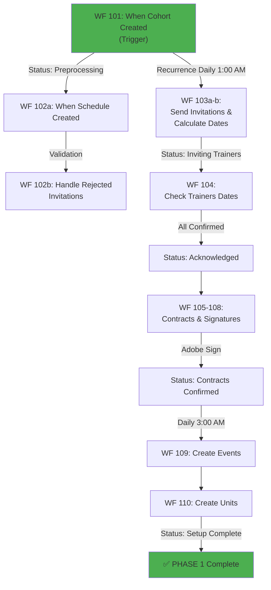

# 🏗️ System Architecture

## Overview of the Flow

The **Programme Pathway Portal** functions as an **event orchestration system** where each phase triggers the next through automatic validations:

```
[User Creates Cohort]
         ↓
    WF 101 (TRIGGER)
    "When Cohort Created"
         ↓
┌────────────────────────────────────────────────┐
│      PHASE 1: COHORT SETUP                     │
│      WF 101-110                                 │
│  - Data validation                             │
│  - Schedule creation                           │
│  - Cohort unit creation                        │
└────────────────────────────────────────────────┘
         ↓
┌────────────────────────────────────────────────┐
│      PHASE 2: TRAINERS                         │
│      WF 103-110                                 │
│  - Sending invitations                         │
│  - Confirming availability                     │
│  - Sending and signing contracts               │
│  - Creating online events                      │
└────────────────────────────────────────────────┘
         ↓
    ┌─────────────────────────────────────────┐
    │ PHASE 3: COACHES          PHASE 4: MARKERS│
    │ WF 201-207               WF 301-307      │
    │ (In Parallel)            (In Parallel)   │
    │ - Invitations            - Invitations   │
    │ - Confirmation           - Confirmation  │
    │ - Contracts              - Contracts     │
    └─────────────────────────────────────────┘
         ↓
    [PREPARATION COMPLETE]
    (Ready for Attendance)
```

---

## 📊 Detailed Phase Diagram

### PHASE 1: COHORT SETUP (WF 101-110)

**Objective:** Create the base structure of the cohort and prepare to receive trainers



### PHASE 2: TRAINERS (WF 103-110 Detailed)

**Objective:** Confirm trainer availability and process contracts

| # | Workflow | Trigger | Status | Action |
|---|----------|---------|--------|--------|
| 103a | Send Invitation & Wait | Recurrence (1:00 AM) | "Inviting Trainers" | Send email/Teams |
| 104 | Check Dates Confirmed | Recurrence (1:00 AM) | "Dates Confirmed" | Verify confirmation |
| 105 | Send Contracts | Recurrence (1:30 AM) | "Sending Contracts" | Send documents |
| 106 | Send via Adobe Sign | Automatic | - | Integrate signing |
| 107 | Check Adobe Agreement | Recurrence Daily | - | Verify signature |
| 108 | Check Contracts Confirmed | Recurrence Daily | "Contracts Confirmed" | Finalize contracts |
| 109 | Create Online Events | Recurrence (3:00 AM) | "Events Created" | Create Teams meetings |
| 110 | Create Units | Automatic | "Units Created" | Prepare structure |

### PHASE 3: COACHES (WF 201-207)

**Objective:** Same logic as trainers, in parallel

| # | Workflow | Function | Status |
|---|----------|----------|--------|
| 201a | Send Capacity Confirmation | Send invitation | "Coach Capacity Pending" |
| 201b | Handle Rejected | Resend | - |
| 202 | Wait for Confirmation | Await response | - |
| 203 | Check Confirmed | Verify | "Coach Capacity Confirmed" |
| 204 | Send Contracts | Send docs | "Sending Contracts" |
| 205 | Send via Adobe Sign | Signing | - |
| 206 | Check Adobe | Verify | - |
| 207 | Check Confirmed | Finalize | "Coaches Confirmed" |

### PHASE 4: MARKERS (WF 301-307)

**Objective:** Same logic as coaches, in parallel

| # | Workflow | Function | Status |
|---|----------|----------|--------|
| 301a | Send Capacity Confirmation | Send invitation | "Marker Capacity Pending" |
| 301b | Handle Rejected | Resend | - |
| 302 | Wait for Confirmation | Await response | - |
| 303 | Check Confirmed | Verify | "Marker Capacity Confirmed" |
| 304 | Send Contracts | Send docs | "Sending Contracts" |
| 305 | Send via Adobe Sign | Signing | - |
| 306 | Check Adobe | Verify | - |
| 307 | Check Confirmed | Finalize | "Markers Confirmed" |

---

## 🔄 Data Flow

```
┌─────────────────────────────────────────────────────┐
│           SHAREPOINT ONLINE (Central Database)      │
│                                                     │
│  ├─ List: Cohorts                                  │
│  ├─ List: Schedules                                │
│  ├─ List: Trainers                                 │
│  ├─ List: Coaches                                  │
│  ├─ List: Markers                                  │
│  ├─ List: Masterclass                              │
│  ├─ List: Programs                                 │
│  ├─ List: Confirmations                            │
│  └─ Library: Contracts (documents)                 │
└─────────────────────────────────────────────────────┘
           ↕ (Read/Write)
┌─────────────────────────────────────────────────────┐
│        POWER AUTOMATE (Orchestration)               │
│  WF 101 → WF 102-110 → (WF 201-207 | WF 301-307)  │
└─────────────────────────────────────────────────────┘
    ↓              ↓                 ↓
┌──────────┐  ┌──────────┐     ┌───────────┐
│Office365 │  │Teams     │     │AdobeSign  │
│(Emails)  │  │(Events)  │     │(Contracts)│
└──────────┘  └──────────┘     └───────────┘
    ↓              ↓                 ↓
[Notifications] [Meetings] [Digital Signatures]
```

---

## ⏰ Scheduling & Triggers

### Type 1: Event-Based Triggers
- **WF 101**: When a Cohort is created
- **WF 102a**: When a Schedule is created
- **WF 102b, 201b, 301b**: When invitations are rejected

### Type 2: Recurrence Triggers (Periodic Checks)

| Workflow | Frequency | Time | Function |
|----------|-----------|------|----------|
| WF 103a | Daily | 1:00 AM | Send trainer invitations |
| WF 104 | Daily | 1:00 AM | Check confirmations |
| WF 105 | Daily | 1:30 AM | Send trainer contracts |
| WF 107 | Daily | - | Check Adobe Sign |
| WF 109 | Daily | 3:00 AM | Create Teams events |
| WF 201a | Daily | 3:45 AM | Send coach invitations |
| WF 301a | Daily | ~4:30 AM | Send marker invitations |

**Note:** Times are during off-peak hours to avoid operational conflicts

---

## 🔐 States & Transitions

The system uses **numbered states** to track progress:

```
Cohort Lifecycle:
0: Pending
1: Preprocessing Data Validation
2: Creating Cohort Schedule
3: Inviting Trainers
4: All Trainers Dates Confirmed
5: Sending Out Trainers Contracts
6: All Trainers Contracts Confirmed
8: All Online Events Created
10: All Cohorts Units Created
[20-23]: Coach stages
[30-33]: Marker stages
```

---

## 🤝 Dependencies & Architectural Decisions

### Why SharePoint?
✅ Client requirement (existing infrastructure)
✅ Natural integration with Office 365
✅ Granular permission control
✅ Document versioning

### Why Power Automate?
✅ Strong SharePoint integration
✅ Native Adobe Sign support
✅ Scheduling (recurrences)
✅ Refined error handling

### Why Parallelization (Coaches + Markers)?
✅ No dependencies between them
✅ Reduces total time (days → hours)
✅ Better scalability

---

## 🚀 Next Steps & Future Phases

- ⏳ **Phase 5: Attendance** (in progress)
- ⏳ **Phase 6: Additional Workflows** (planned)
- 📡 Possibility of BI system integration for reporting

---

For individual workflow details, see [Reference Table](Workflows/00_WORKFLOW_REFERENCE.md).
