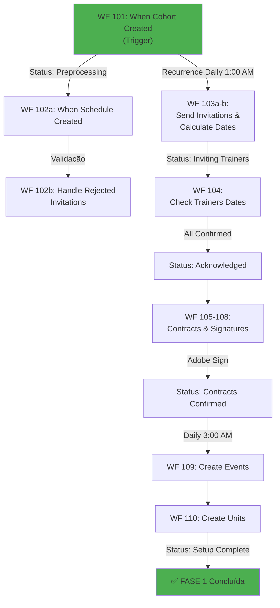

# 🏗️ Arquitetura do Sistema

## Visão Geral do Fluxo

O **Programme Pathway Portal** funciona como uma **orquestração de eventos** onde cada fase dispara a próxima através de validações automáticas:

```
[Usuário Cria Cohort]
         ↓
    WF 101 (TRIGGER)
    "When Cohort Created"
         ↓
┌────────────────────────────────────────────────┐
│      FASE 1: SETUP DO COHORT                   │
│      WF 101-110                                 │
│  - Validação de dados                          │
│  - Criação de agenda                           │
│  - Criação de unidades do cohort               │
└────────────────────────────────────────────────┘
         ↓
┌────────────────────────────────────────────────┐
│      FASE 2: TRAINERS                          │
│      WF 102-110                                 │
│  - Envio de convites                           │
│  - Confirmação de disponibilidade              │
│  - Envio e assinatura de contratos             │
│  - Criação de eventos online                   │
└────────────────────────────────────────────────┘
         ↓
    ┌─────────────────────────────────────────┐
    │ FASE 3: COACHES          FASE 4: MARKERS │
    │ WF 201-207               WF 301-307      │
    │ (Em Paralelo)            (Em Paralelo)   │
    │ - Convites               - Convites      │
    │ - Confirmação            - Confirmação   │
    │ - Contratos              - Contratos     │
    └─────────────────────────────────────────┘
         ↓
    [FIM DA PREPARAÇÃO]
    (Pronto para Attendance)
```

---

## 📊 Diagrama Detalhado por Fase

### FASE 1: SETUP DO COHORT (WF 101-110)

**Objetivo:** Criar a estrutura base do cohort e preparar para receber trainers



### FASE 2: TRAINERS (WF 102-110 detalhado)

**Objetivo:** Confirmar disponibilidade de trainers e processar contratos

| # | Workflow | Trigger | Status | Ação |
|---|----------|---------|--------|------|
| 102a | When Schedule is Created | Evento | - | Dispara fluxo apropriado |
| 102b | Handle Rejected Invitations | Rejeição | - | Re-envia convites |
| 103a | Send Invitation & Wait | Recurrence (1:00 AM) | "Inviting Trainers" | Envia email/Teams |
| 104 | Check Dates Confirmed | Recurrence (1:00 AM) | "Dates Confirmed" | Verifica confirmação |
| 105 | Send Contracts | Recurrence (1:30 AM) | "Sending Contracts" | Envia documentos |
| 106 | Send via Adobe Sign | Automático | - | Integra assinatura |
| 107 | Check Adobe Agreement | Recurrence Daily | - | Verifica assinatura |
| 108 | Check Contracts Confirmed | Recurrence Daily | "Contracts Confirmed" | Finaliza contratos |
| 109 | Create Online Events | Recurrence (3:00 AM) | "Events Created" | Cria Teams meetings |
| 110 | Create Units | Automático | "Units Created" | Prepara estrutura |

### FASE 3: COACHES (WF 201-207)

**Objetivo:** Mesma lógica que trainers, em paralelo

| # | Workflow | Função | Status |
|---|----------|--------|--------|
| 201a | Send Capacity Confirmation | Envia convite | "Coach Capacity Pending" |
| 201b | Handle Rejected | Re-envia | - |
| 202 | Wait for Confirmation | Aguarda resposta | - |
| 203 | Check Confirmed | Verifica | "Coach Capacity Confirmed" |
| 204 | Send Contracts | Envia docs | "Sending Contracts" |
| 205 | Send via Adobe Sign | Assinatura | - |
| 206 | Check Adobe | Verifica | - |
| 207 | Check Confirmed | Finaliza | "Coaches Confirmed" |

### FASE 4: MARKERS (WF 301-307)

**Objetivo:** Mesma lógica que coaches, em paralelo

| # | Workflow | Função | Status |
|---|----------|--------|--------|
| 301a | Send Capacity Confirmation | Envia convite | "Marker Capacity Pending" |
| 301b | Handle Rejected | Re-envia | - |
| 302 | Wait for Confirmation | Aguarda resposta | - |
| 303 | Check Confirmed | Verifica | "Marker Capacity Confirmed" |
| 304 | Send Contracts | Envia docs | "Sending Contracts" |
| 305 | Send via Adobe Sign | Assinatura | - |
| 306 | Check Adobe | Verifica | - |
| 307 | Check Confirmed | Finaliza | "Markers Confirmed" |

---

## 🔄 Fluxo de Dados

```
┌─────────────────────────────────────────────────────┐
│           SHAREPOINT ONLINE (Banco Central)         │
│                                                     │
│  ├─ Lista: Cohorts                                 │
│  ├─ Lista: Schedules                               │
│  ├─ Lista: Trainers                                │
│  ├─ Lista: Coaches                                 │
│  ├─ Lista: Markers                                 │
│  ├─ Lista: Masterclass                             │
│  ├─ Lista: Programs                                │
│  ├─ Lista: Confirmations                           │
│  └─ Biblioteca: Contratos (documentos)             │
└─────────────────────────────────────────────────────┘
           ↕ (Leitura/Escrita)
┌─────────────────────────────────────────────────────┐
│        POWER AUTOMATE (Orquestração)                │
│  WF 101 → WF 102-110 → (WF 201-207 | WF 301-307)  │
└─────────────────────────────────────────────────────┘
    ↓              ↓                 ↓
┌──────────┐  ┌──────────┐     ┌───────────┐
│Office365 │  │Teams     │     │AdobeSign  │
│(Emails)  │  │(Events)  │     │(Contracts)│
└──────────┘  └──────────┘     └───────────┘
    ↓              ↓                 ↓
[Notificações] [Reuniões] [Assinaturas Digitais]
```

---

## ⏰ Scheduling & Triggers

### Tipo 1: Event-Based Triggers
- **WF 101**: Quando um Cohort é criado
- **WF 102a**: Quando uma Schedule é criada
- **WF 102b, 201b, 301b**: Quando convites são rejeitados

### Tipo 2: Recurrence Triggers (Verificações Periódicas)

| Workflow | Frequência | Horário | Função |
|----------|------------|---------|--------|
| WF 103a | Diária | 1:00 AM | Enviar convites trainers |
| WF 104 | Diária | 1:00 AM | Verificar confirmações |
| WF 105 | Diária | 1:30 AM | Enviar contratos trainers |
| WF 107 | Diária | - | Verificar Adobe Sign |
| WF 109 | Diária | 3:00 AM | Criar eventos Teams |
| WF 201a | Diária | 3:45 AM | Enviar convites coaches |
| WF 301a | Diária | ~4:30 AM | Enviar convites markers |

**Nota:** Horários durante madrugada para evitar conflitos operacionais

---

## 🔐 Estados & Transições

O sistema utiliza **estados numerados** para rastrear progresso:

```
Cohort Lifecycle:
0: Pending
1: Preprocessing Data Validation
2: Creating Cohort Schedule
3: Inviting Trainers
4: All Trainers Dates Confirmed
5: Sending Out Trainers Contracts
6: All Trainers Contracts Confirmed
8: All Online Events Created
10: All Cohorts Units Created
[20-23]: Coach stages
[30-33]: Marker stages
```

---

## 🤝 Dependências & Decisões Arquiteturais

### Por que SharePoint?
✅ Requisito do cliente (infraestrutura existente)
✅ Integração natural com Office 365
✅ Controle de permissões refinado
✅ Versionamento de documentos

### Por que Power Automate?
✅ Integração forte com SharePoint
✅ Suporte nativo para Adobe Sign
✅ Agendamento (recurrences)
✅ Tratamento de erros refinado

### Por que Parallelização (Coaches + Markers)?
✅ Não há dependências entre eles
✅ Reduz tempo total (dias → horas)
✅ Melhor escalabilidade

---

## 🚀 Próximos Passos & Fases Futuras

- ⏳ **Fase 5: Attendance** (em desenvolvimento)
- ⏳ **Fase 6: Workflows Adicionais** (planejado)
- 📡 Possibilidade de integração com sistemas de BI para relatórios

---

Para detalhes de cada workflow individual, consulte a [Tabela de Referência](Workflows/00_WORKFLOW_REFERENCE.md).
